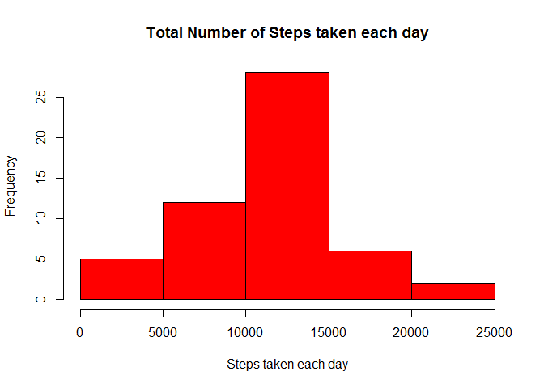
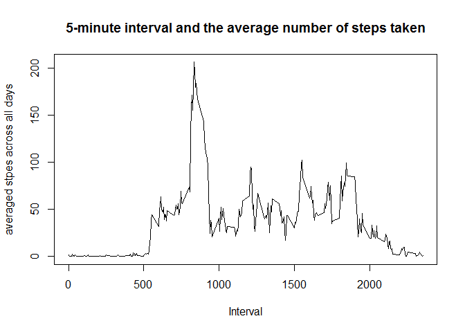
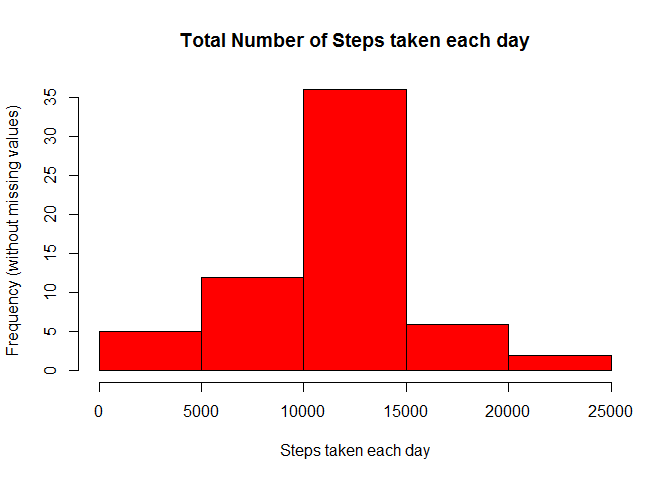

# Reproducible Research: Peer Assessment 1


## Loading and preprocessing the data

*Load the data*

```r
df <- read.csv("activity.csv")
```
*Process/transform the data into a format suitable for my analysis*

```r
 # Total Number of Steps whitout missing values
tns <- aggregate(steps ~ date, data = df, sum, na.rm = TRUE)
# Mean of Steps Interval whitout missing values
msi <- aggregate(steps ~ interval, data = df, mean, na.rm = TRUE) 
```

## What is mean total number of steps taken per day?

*Calculate the total number of steps taken per day*

```r
hist(tns$steps, col ="red", main = "Total Number of Steps taken each day",
	 xlab = "Steps taken each day", ylab = "Frequency")
```

<!-- -->

*Calculate the mean and median of the total number of steps taken per day*

```r
m <-  round(mean(tns$steps))
ma <- median(tns$steps)
```

- The mean of the total number of steps taken per day is 1.0766\times 10^{4} steps.
- The median of the total number of steps taken per day is 10765 steps.

## What is the average daily activity pattern?

*Make a time series plot (i.e. type = "l") of the 5-minute interval (x-axis) and the average number of steps taken, averaged across all days (y-axis)*

```r
plot(steps ~ interval, data = msi, type = "l",
	 main = "5-minute interval and the average number of steps taken",
	 xlab = "Interval", ylab ="averaged stpes across all days")
```

<!-- -->

*Which 5-minute interval, on average across all the days in the dataset,contains the maximum number of steps?*

```r
M <- msi[ which.max(msi$steps), "interval" ]
```
- It is the 835 th interval

## Imputing missing values

*Calculate and report the total number of missing values in the dataset*
*(i.e. the total number of rows with NAs) *

```r
S <- sum(is.na(df$steps))
```
- Total 2304 rows are missing.

*Create a new dataset that is equal to the original dataset but with the *
*missing data filled in. My strategy for filing in all of the missing values*
*in the dataset was to fill the mean for the 5-minute interval that has*
*missing values.*

```r
dfn <- df   # Make a copy of the dataset with the original data

for(i in 1:nrow(df)) {
	if( is.na(dfn[i, "steps"]) ) {
		dfn[i, "steps"] <- msi[ msi$interval == df[i, "interval"], "steps"]
	}
}
```

*Make a histogram of the total number of steps taken each day and*
*Calculate and report the mean and median total number of steps taken per day*

```r
tns2 <- aggregate(steps ~ date, data = dfn, sum)
hist(tns2$steps, col ="red", main = "Total Number of Steps taken each day",
	 xlab = "Steps taken each day", ylab = "Frequency (without missing values)")
```

<!-- -->

```r
m <- mean(tns2$steps)
ma <- median(tns2$steps)
```
- The mean of the total number of steps taken per day is 1.0766189\times 10^{4} steps.
- The median of the total number of steps taken per day is 1.0766189\times 10^{4} steps.

*Do these values differ from the estimates from the first part of the*
*assignment? What is the impact of imputing missing data on the estimates*
*of the total daily number of steps?*

The mean value is the same because I fill the missing value with the mean value
for that particular 5-min interval. However the median value shows a little
difference, depending on on where the missing values are.

## Are there differences in activity patterns between weekdays and weekends?

*Create a new factor variable in the dataset with two levels - "weekday"*
*and "weekend" indicating whether a given date is a weekday or weekend day.*

```r
dfn$day <- ifelse(as.POSIXlt(as.Date(dfn$date))$wday %% 6 == 0, "weekend", "weekday")
dfn$day <- factor(dfn$day, levels = c("weekday", "weekend") )
```
*Make a panel plot containing a time series plot (i.e. type = "l") of the*
*5-minute interval (x-axis) and the average number of steps taken, averaged*
*across all weekday days or weekend days (y-axis).*

```r
msi2 <- aggregate(steps ~ interval + day, data = dfn, mean)
library(lattice)
xyplot(steps ~ interval | factor(day), data = msi2, layout = c(1,2), type="l")
```

<!-- -->
